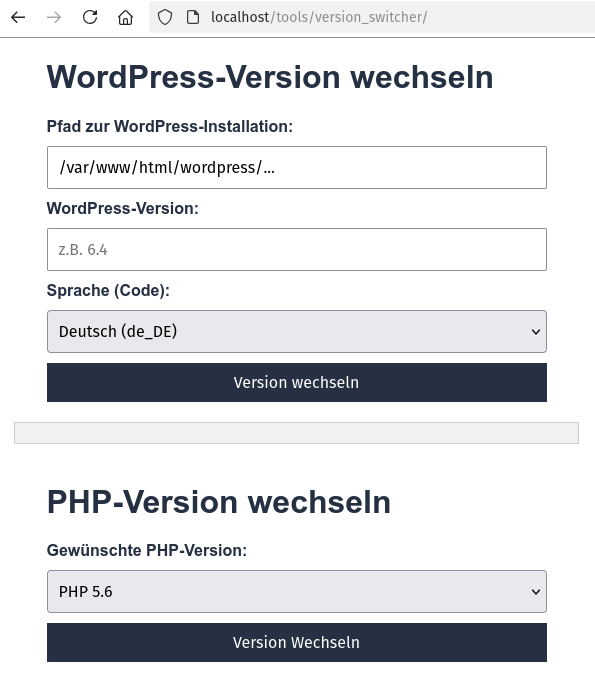

# version_switcher

Ein einfacher Versionswechsler zur Verwaltung von WordPress- und PHP-Versionen auf einem Apache-Server.

## Übersicht

So sieht das Dashboard aus:



## Nutzung

1. **Rufe das Dashboard auf**  
   Öffne die folgende URL in deinem Browser:

   ```
   http://<deine-server-ip>/tools/version_switcher/index.html
   (z. B. http://localhost/tools/version_switcher/index.html)
   ```

2. **Wechsel der WordPress-Version**

   - Gib den Pfad zur WordPress-Installation ein.
   - Wähle die gewünschte Version und Sprache aus.
   - Klicke auf "Version wechseln". Das Tool erstellt **automatisch ein Backup** der Datenbank und der wichtigsten Dateien, bevor die neue Version heruntergeladen wird.
   - Das [Ergebnis][wp-switch] wird im Ausgabefeld angezeigt.

3. **Wechsel der PHP-Version**
   - Wähle die gewünschte [PHP-Version][php-in] aus.
   - Klicke auf "Version wechseln". Die [PHP-Version wird geändert][php-out] und der Webserver wird automatisch neu gestartet.

## Voraussetzungen

- **Unterstützte Betriebssysteme**:  
  Dieses Setup wurde für **Linux-basierte Systeme** wie Ubuntu, Debian oder vergleichbare Distributionen entwickelt und getestet. Es setzt die Verwendung von Bash-Skripten und Linux-Befehlen voraus. Auf Windows oder macOS kann es zu Kompatibilitätsproblemen kommen, es sei denn, eine Linux-kompatible Umgebung wird verwendet (z. B. Windows Subsystem for Linux (WSL) oder Docker).

- **PHP**: Die verfügbaren PHP-Versionen müssen auf dem Server installiert und die entsprechenden Apache-Module [`libapache2-mod-php`](https://ubuntu.com/server/docs/how-to-install-and-configure-php#install-php) konfiguriert sein.
- **WordPress**: Das WordPress-Command-Line-Interface [wp-cli](https://wp-cli.org/) muss installiert sein.
- **Rechte**: Der Apache-Benutzer (`www-data`) benötigt Zugriff auf die WordPress-Verzeichnisse und die Skripte.

## Installation

1. **Kopiere die Dateien**  
   Kopiere den Ordner `version_switcher` in ein Verzeichnis im `DocumentRoot` deines Apache-Servers (Bsp.: `/var/www/html/tools`).

2. **Berechtigungen setzen**  
   Führe diese Befehle im Terminal aus:

   ```bash
   chmod +x /var/www/html/tools/version_switcher/wp_switcher.sh
   chmod 644 /var/www/html/tools/version_switcher/execute-script.php
   chmod 644 /var/www/html/tools/version_switcher/php_switcher.php
   chmod 644 /var/www/html/tools/version_switcher/index.html
   chown -R www-data:www-data /var/www/html/tools/
   chown -R www-data:www-data /var/www/html/wordpress/
   ```

## Vorteile

- **Leichtgewichtig**: Keine zusätzlichen Abhängigkeiten wie `Node.js`.
- **Einfach wartbar**: Klar strukturierte Skripte und minimaler Overhead.
- **Flexibilität**: Unterstützt mehrere PHP-Versionen und WordPress-Instanzen.

## Fehlersuche

### Häufige Probleme und Lösungen

1. **WP-CLI ist nicht installiert**

   - Fehler: `wp: command not found`  
     Lösung: Installiere `wp-cli`:
     ```bash
     curl -O https://raw.githubusercontent.com/wp-cli/builds/gh-pages/phar/wp-cli.phar
     chmod +x wp-cli.phar
     sudo mv wp-cli.phar /usr/local/bin/wp
     ```

2. **Apache startet nicht neu**

   - Fehler: Die PHP-Version wurde gewechselt, aber Apache konnte nicht neu gestartet werden.  
     Lösung: Überprüfe die Apache-Konfiguration:
     ```bash
     sudo systemctl restart apache2
     ```

3. **Berechtigungsprobleme**
   - Fehler: Zugriff verweigert (`Permission denied`)  
     Lösung: Setze die richtigen Berechtigungen:
     ```bash
     sudo chown -R www-data:www-data /var/www/html/wordpress/
     ```

## Backup-Funktionalität

Vor dem Wechsel einer WordPress-Version wird automatisch ein Backup angelegt. Das Tool sichert folgende Elemente:

1. **Datenbank**: Die gesamte Datenbank wird in einer `.sql`-Datei exportiert.
2. **Wichtige Dateien**:
   - `wp-config.php`
   - Der Ordner `wp-content`
3. **Komprimierung**: Alle Backups werden in einer `.tar.gz`-Datei gespeichert, um Speicherplatz zu sparen.

Die Backups werden im [Verzeichnis der angegebenen WordPress-Installation][backup] abgelegt und enthalten einen Zeitstempel.

## Sicherheitshinweise

- Betreibe die Skripte nicht in einer öffentlich zugänglichen Umgebung ohne zusätzliche Authentifizierung.
- Nutze HTTPS, um die Übertragung von Eingaben zu sichern.
- Stelle sicher, dass der Server hinter einer Firewall betrieben wird.

[backup]: screenshots/structure_backups.png
[wp-switch]: screenshots/wp-switch.png
[php-out]: screenshots/php-output.png
[php-in]: screenshots/php-switch.png
